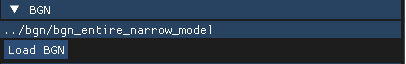
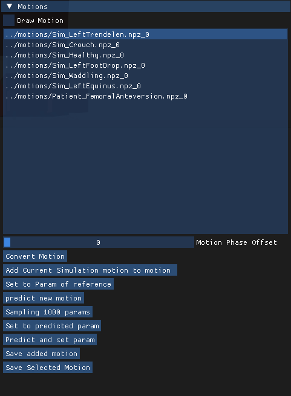

# Bidirectional GaitNet 

This code is an implementation of Bidirectional GaitNet (SIGGRAPH 2023). It includes "Generative GaitNet (SIGGRAPH 2022)."

## Abstract 

We present a novel generative model, called Bidirectional GaitNet, that learns the relationship between human anatomy and its gait. The simulation model of human anatomy is a comprehensive, full-body, simulation-ready, musculoskeletal model with 304 Hill-type musculotendon units. The Bidirectional GaitNet consists of forward and backward models. The forward model predicts a gait pattern of a person with specific physical conditions, while the backward model estimates the physical conditions of a person when his/her gait pattern is provided. Our simulation-based approach first learns the forward model by distilling the simulation data generated by a state-of-the-art predictive gait simulator and then constructs a Variational Autoencoder (VAE) with the learned forward model as its decoder. Once it is learned its encoder serves as the backward model. We demonstrate our model on a variety of healthy/impaired gaits and validate it in comparison with physical examination data of real patients.

## Publications

https://arxiv.org/pdf/2306.04161.pdf 

Jungnam Park, Moon Seok Park, Jehee Lee, and Jungdam Won
Generative GaitNet, SIGGRAPH 2023 Conference Proceedings. 

## Video (Youtube)

[](https://youtu.be/_Ey8VvKIgAM)

## Installation & Compile

We checked this code works in Python 3.6, ray(rllib) 1.8.0 and Cluster Server (64 CPUs (128 threads) and 1 GPU (RTX 3090) per node).

1. Install required dependencies for DartSim (v6.9.2).

```bash
sudo apt-get install build-essential cmake pkg-config git
sudo apt-get install libeigen3-dev libassimp-dev libccd-dev libfcl-dev libboost-regex-dev libboost-system-dev
sudo apt-get install libopenscenegraph-dev libnlopt-cxx-dev coinor-libipopt-dev libbullet-dev libode-dev liboctomap-dev  libxi-dev libxmu-dev freeglut3-dev libopenscenegraph-dev
```

2. Install other libraries automatically.

```bash
cd {downloaded folder}/
./install.sh
```

3. Compile.

```bash
cd {downloaded folder}/
./pc_build.sh
cd build
make -j32
```
You can use 'build.sh' instead of 'pc_build.sh' when training on the server without a GUI.

## Learning

Our system has two parts, 'Generative GaitNet' and 'Bidirectional GaitNet.' The data generated by Generative GaitNet is used as the training data for Bidirectional GaitNet. Below is the training and data collection methods for Generative GaitNet and the training method for Bidirectional GaitNet.

### Generative GaitNet (SIGGRAPH 2022)

1. Set 'env.xml.'

- Parameterization of anatomical and gait conditions

```bash
<parameter>
    # Gait Conditions
    <gait>
        <stride ... />
        <cadence ... />
    </gait>

    # Skeletal Conditions
    <skeleton>
        <global ... />
        <{name of body node} ... />
                ...
    </skeleton>
    <torsion>
        <{name of lower body node} ... />
                ...
    </torsion>

    # Muscle Conditions
    <muscle_length>
        <{name of muscle (left)} ... />
        <{name of muscle (right)} ... />
                ...
    </muscle_length>
    <muscle_force>
        <{name of muscle (left)} ... />
        <{name of muscle (right)} ... />
                ...
    </muscle_force>  
</parameter>
```

- Cascading Map 

```bash
<cascading>
    <networks>
        <nn0>{network path}</nn0>
        <nn1>{network path}</nn1>
        <nn2>{network path}</nn2>
                ...
    </networks>
    <edges>
        <edge0 start="{network number}" end="{network number}" />
        <edge1 start="{network number}" end="{network number}" />
                ...
    </edges>
</cascading>
```

2. Execute learning 

```bash
cd {downloaded folder}/python
python3 ray_train.py --config {training_configure} --name {training_name}
```
You can check {training_configure} in ray_config.py.

### Bidirectional GaitNet (SIGGRAPH 2023)

1. Rollout and save raw data. Then, augment the data to trainable format.

With the learned Generative GaitNet, you can collect trining data for Bidictional Gaitnet. First of all, complete the cascading map in the env.xml.

```bash
python3 ray_train.py --config {training_configure} --name {training_name} --rollout
```

Data(*.npz) is saved in ```python/rollout``` directory. 

```bash
python3 augument_raw_data.py --motion {data directory} --save {directory for augmented data} --env {xml path} --name {file set name}
```

Then, write the directory path containing the augmented data on ```motion.txt```.

2. Train forward gaitnet.

```bash
python3 train_forward_gaitnet.py --name {training_name} --env {xml path}
```

3. Train backward gaitnet.

```bash
python3 train_backward_gaitnet.py --name {training_name} --fgn {forward gaitnet path}
```

## Rendering

1. Execute viewer (Generative GaitNet).

```bash
cd {downloaded folder}/build
./viewer/viewer {network path or environment xml name}
```
2. After execute viewer, load forward gaitnet. click 'Load FGN' (Forward GaitNet).


3. After load forward gaitnet, click 'load BGN.'



4. Select motion and click 'Set to Param of reference.' Then click 'Predict and set param' (Backward GaitNet).




## Additional Information

With the generated data, which of conditions consists of (skeleton(3%), muscle around ankle and knee(5%), and entire lower body muscles (92%)), the example networks (bgn_entire_narrow_model, fgn_entire_narrow_model) are traind.


## Contact 

jungnam04@imo.snu.ac.kr
